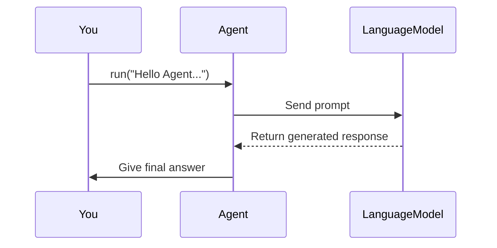

# Chapter 1: Agent

Welcome to our journey in building an intelligent, extensible system! In this first chapter, we introduce the core entity called an “Agent.” Think of the Agent as a skilled operator who receives your question (or prompt) and figures out the best way to solve it. Sometimes, it will directly respond using its built-in language model, and other times it may call specialized helpers (Tools) to do certain tasks. By the end of this chapter, you will understand what an Agent is, why it’s useful, and how to get started with it in your own code.

---

## 1. Why Do We Need an Agent?

Imagine you have a chatbot that can not only answer questions but also perform specific tasks like searching the web, generating images, or performing calculations. You could build all these features directly into one big system, but it quickly becomes complicated.

The Agent simplifies everything by acting as a “control tower”:
1. It takes your request.
2. Figures out if it can answer directly.
3. If not, it delegates tasks to any relevant tools.
4. It compiles the final answer back to you.

---

## 2. A Very Simple Use Case

Let’s start with an ultra-simple scenario: we just want the Agent to respond to user messages using a language model. We won’t worry about Tools just yet (we’ll see them in [Tool](02_tool_.md)).

Below is a short snippet showing how we can instantiate and use an Agent:

```python
# In a file like main.py
from redpanda.agents import Agent

# Create an agent with minimal setup
my_agent = Agent(
    name="MyFirstAgent",
    model="openai/gpt-3.5-turbo",      # Use your favorite model
    instructions="Please answer in a friendly style."
)

# Now let's ask something
response = await my_agent.run("Hello Agent, what's your favorite color?")
print(response)  # It will print a response based on the language model
```

Explanation of the snippet:
- We import the `Agent` from the `redpanda.agents` module.  
- We instantiate it by giving it a name, specifying which language model to use, and optionally providing instructions (like a system prompt).  
- We call `run(...)` with a user message, and the Agent replies with the model’s generated text.

---

## 3. Key Concepts Inside the Agent

1. **Model Selection**:  
   Determines which language model the agent uses to generate text.  
   Example: “openai/gpt-3.5-turbo.”  

2. **Instructions**:  
   Act like the “role” or system prompt. You can set the tone or style of the Agent’s answers here.  

3. **Hooks** ([AgentHooks](04_agenthooks_.md)):  
   Optional callbacks to track events like “agent started,” “tool started,” etc. Beginners can skip this.  

4. **Tools** ([Tool](02_tool_.md)):  
   Specialized tasks the Agent can call. For now, we keep it minimal, but Tools help you do powerful things (like image generation, data lookups, etc.) when the Agent decides it needs them.  

---

## 4. Inside the Agent: What’s Really Happening?

When you call `my_agent.run("...")`, here’s a simplified flow:



1. You provide the question or command.  
2. The Agent resolves which model to use and how to structure the prompt.  
3. The language model (LLM) processes the prompt and returns a response.  
4. The Agent sends that final answer back to you.

When Tools and Hooks are involved, the diagram gains extra steps, but this is the core idea.  

---

## 5. Inside the Code (A Peek Under the Hood)

The main code for the Agent is in [src/redpanda/agents/_agent.py](../src/redpanda/agents/_agent.py). Key points:

- The `Agent` class has a `run(...)` method that orchestrates the conversation flow.  
- If there are Tools, the Agent can detect when the model wants to call them and handle that automatically.  
- `AgentHooks` offers specialized events to help you track or customize certain moments.  

For example, the Agent checks if the language model’s response indicates a function (tool) call. If so, it calls that tool, captures the result, and continues until it finds a final text answer.

Below is an ultra-condensed excerpt (simplified for demonstration) showing how the Agent orchestrates a single response:

```python
async def run(self, input_text: str) -> str:
    # (1) Notify start
    await self.hooks.on_start(self)
    
    # (2) Prepare messages and send to LLM
    messages = [{"role": "user", "content": input_text}]
    llm_response = await some_llm_completion_call(messages, self.model)
    
    # (3) If there's a tool call needed, handle it (omitted for brevity)
    # ...

    # (4) Finalize
    final_text = llm_response.content
    await self.hooks.on_end(self, final_text)
    return final_text
```

Explanation of the snippet:  
- (1) We let the hooks know the Agent is starting.  
- (2) We build messages for the language model and get a response.  
- (3) If the response suggests calling a Tool, we handle it (skipped here for review in [Tool](02_tool_.md)).  
- (4) We finalize the text and notify any hooks.  

---

## 6. Summary and Next Steps

• The Agent is your main entry point for interacting with a language model (or multiple Tools) in a clean, modular way.  
• It can respond directly or coordinate tasks across different Tools.  
• By adjusting properties like instructions, you can shape how the Agent communicates.  

In the next chapter, we will introduce the concept of a [Tool](02_tool_.md) and see how the Agent cooperates with specialized assistants to solve more complex tasks.  

Keep going, and soon you’ll have a flexible, powerful system that can handle a wide range of requests!  
