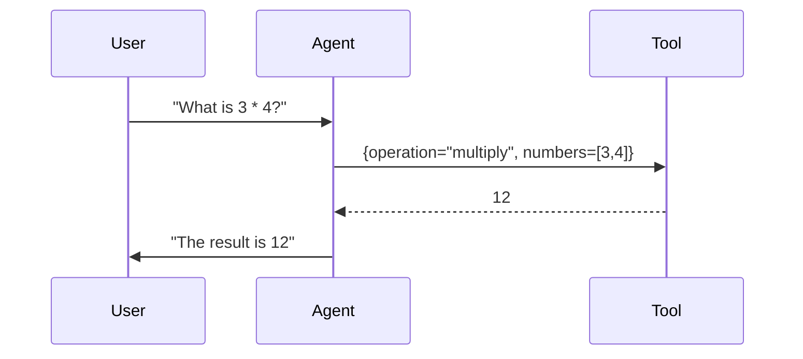

# Chapter 2: Tool

In [Chapter 1: Agent](01_agent_.md), we introduced the Agent as our main character who decides how to handle your requests. Sometimes the Agent directly provides answers; but what if the Agent encounters a special task requiring extra skills or data handling? That’s where a Tool comes in.

## 1. Motivation & Basic Idea

A Tool is like a “sidekick” for the Agent. Whenever the Agent needs extra abilities—like looking up data, making calculations, or generating images—it calls on the right Tool with the needed parameters. This is similar to delegating a small job to a trusted co-worker who’s an expert in that specific task.

Here’s what makes a Tool so helpful:
• It has a clear name and a brief description describing its specialty.  
• It defines the parameters it can accept, like how a function accepts arguments.  
• When the Agent can’t do something on its own, it knows which Tool to call and which parameters to send in.

## 2. The Core Concept of a Tool

Let’s break down the essentials of a Tool:

1. Name:  
   A unique identifier, like "ImageGenerator" or "Calculator".

2. Description:  
   A short explanation of what this Tool does.

3. Parameters:  
   A structured set of arguments (like a schema) the Agent must provide when invoking the Tool.  
   For example, a Calculator Tool might expect parameters like `{ "operation": "add", "numbers": [1,2,3] }`.

Once the Agent calls a Tool, the Tool does its specialized job and returns the result. The Agent then incorporates that result into its final answer.

## 3. A Very Simple Use Case

Suppose we want our Agent to handle basic math. Rather than programming math logic inside the Agent, we can create a simple Tool called "NumberCruncher" that handles calculations. Then, when the Agent sees a user request like "What is 3 times 4?" it can call "NumberCruncher" to do the math.

Below is a minimal code snippet demonstrating how we might define and use a Tool for calculations:

```python
# number_cruncher_tool.py
from redpanda.agents import Tool

class NumberCruncher(Tool):
    """
    A simple math tool that performs arithmetic operations.
    """

    def __init__(self):
        super().__init__(
            name="NumberCruncher",
            description="Performs basic arithmetic operations (add, multiply, etc.).",
            parameters={
                "type": "object",
                "properties": {
                    "operation": {"type": "string"},
                    "numbers": {"type": "array", "items": {"type": "number"}}
                },
                "required": ["operation", "numbers"]
            }
        )

    async def __call__(self, args: dict) -> float:
        # 1) Extract parameters
        operation = args["operation"]
        numbers = args["numbers"]

        # 2) Perform operation
        if operation == "add":
            return sum(numbers)
        elif operation == "multiply":
            product = 1
            for num in numbers:
                product *= num
            return product
        else:
            return 0  # fallback or raise an exception
```

### Explanation of the Snippet

• We subclass `Tool` to create a new type of Tool called `NumberCruncher`.  
• In `__init__`, we define its name, description, and a JSON schema for parameters (it requires an `"operation"` and an array of `"numbers"`).  
• Inside `__call__`, we implement how the Tool handles requests—here, simple arithmetic.

## 4. Putting It All Together in the Agent

Imagine we have an Agent that wants to handle math questions. Let’s register our new Tool with the Agent:

```python
# main.py
from redpanda.agents import Agent
from number_cruncher_tool import NumberCruncher

# Create our math tool
math_tool = NumberCruncher()

# Create the Agent and attach the tool
my_agent = Agent(
    name="MathAgent",
    model="openai/gpt-3.5-turbo",
    instructions="You can use NumberCruncher to handle arithmetic.",
    tools=[math_tool]
)

# Agent usage
response = await my_agent.run("What is the product of 3 and 4?")
print(response)
```

### Explanation of What Happens

1. The Agent reads the user’s question: “What is the product of 3 and 4?”  
2. It realizes this might require a math operation, so it calls `NumberCruncher` with something like `"operation": "multiply", "numbers": [3,4]`.  
3. The Tool returns `12`.  
4. The Agent includes `12` in its final answer back to the user.

## 5. Under the Hood

Internally, here’s a quick look at how a Tool call happens:



1. The Agent identifies the request is arithmetic-related.  
2. The Agent calls the “NumberCruncher” Tool with the right arguments.  
3. The Tool performs the math and returns its result (12).  
4. The Agent includes the result in the final response.

## 6. A Quick Peek at the Implementation

In the source code ([src/redpanda/agents/_tools.py](../src/redpanda/agents/_tools.py)), the `Tool` base class looks roughly like this (simplified):

```python
class Tool:
    def __init__(self, name: str, description: str | None, parameters: dict[str, Any]):
        self.name = name
        self.description = description
        self.parameters = parameters

    async def __call__(self, args: dict[str, Any]) -> Any:
        # Implementation for how the tool is invoked
        raise NotImplementedError()
```

When you subclass `Tool`, you just override `__call__` to handle whatever logic you need. The return value can be text, JSON, or a more structured [ToolResponse](03_toolresponse_.md) (which we’ll see in the next chapter).

## 7. Summary and Next Steps

• A Tool is like a specialized helper function for the Agent.  
• You define a name, description, and parameters, then implement the logic in `__call__`.  
• The Agent automatically knows when to call the Tool based on your requests.

Next, we’ll look at how the Tool’s output can be packaged in different formats—sometimes simple text, sometimes more complex data structures. Head over to [Chapter 3: ToolResponse](03_toolresponse_.md) to learn more!
