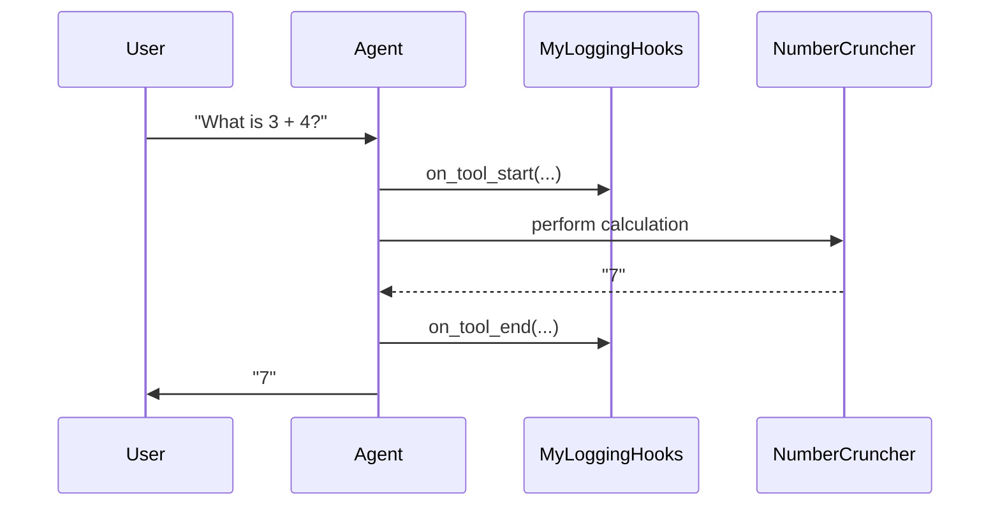

# Chapter 4: AgentHooks

In the [previous chapter: ToolResponse](03_toolresponse_.md), we saw how a Tool can return complex data (like images + text) back to the Agent. Now, let’s explore a powerful feature called AgentHooks. Think of AgentHooks as a backstage crew helping you monitor or modify an Agent’s behavior at key moments—without cluttering the Agent’s main logic.

---

## 1. Why AgentHooks?

Imagine you want to track how long each Tool call takes or record every prompt the Agent sends. You could embed these features inside the Agent, but that might get messy. AgentHooks solves this by providing special “hooks” (callbacks) that run at these pivotal times:

• Before the Agent starts processing.  
• After the Agent finishes.  
• Right before each Tool is called.  
• Right after each Tool finishes.

You can use these hooks to log events, gather metrics, or perform custom actions.

---

## 2. A Basic Use Case

Let’s walk through a simple scenario: we want to measure how much time is spent calling Tools. AgentHooks let us track tool usage without editing the core Agent code.

Below is a minimal example of how we can create a custom AgentHooks class that logs tool call durations:

```python
# custom_hooks.py
import time
from redpanda.agents import AgentHooks

class MyLoggingHooks(AgentHooks):
    async def on_tool_start(self, agent, tool, args):
        self.start_time = time.time()
        print(f"[HOOK] About to call {tool.name} with args: {args}")

    async def on_tool_end(self, agent, tool, result):
        elapsed = time.time() - self.start_time
        print(f"[HOOK] {tool.name} finished. Time: {elapsed:.2f} seconds")
```

Explanation:  
• We inherit from AgentHooks and override two methods—on_tool_start and on_tool_end.  
• When a tool call starts, we store the current time. When it ends, we measure the time elapsed and print it.  

---

## 3. Attaching Hooks to an Agent

Let’s attach our `MyLoggingHooks` to an Agent. Now, whenever the Agent decides to use a Tool, our hooks automatically log timing info!

```python
# main.py
from redpanda.agents import Agent
from custom_hooks import MyLoggingHooks
from number_cruncher_tool import NumberCruncher  # from previous chapters

my_agent = Agent(
    name="AgentWithHooks",
    model="openai/gpt-3.5-turbo",
    tools=[NumberCruncher()],
    hooks=MyLoggingHooks()
)

# Run a sample query to see the hooks in action
response = await my_agent.run("What is 3 + 4?")
print("Final response:", response)
```

What happens:  
1. The Agent sees a math question.  
2. It calls `NumberCruncher`. Our hook logs the start time.  
3. The tool returns a result. Our hook logs the end time and prints duration.  
4. The Agent gives the final response.

---

## 4. Step-by-Step Under the Hood

Here’s a short sequence diagram showing how AgentHooks slip into the flow:



1. User asks a question.  
2. The Agent notifies our hook before calling the tool.  
3. The tool does its work.  
4. The Agent notifies our hook after the tool finishes.  
5. The Agent returns the final answer.

---

## 5. Peeking at the Internal Implementation

Internally, the Agent’s code (in [src/redpanda/agents/_agent.py](../src/redpanda/agents/_agent.py)) calls these callbacks at specific times:

1. on_start(...) before the Agent begins (great for resetting logs or counters).  
2. on_tool_start(...) when a Tool is about to run.  
3. on_tool_end(...) right after a Tool returns.  
4. on_end(...) once the Agent has a final answer.

A simplified snippet looks something like this (shortened for clarity):

```python
# (Simplified) from _agent.py
class Agent:
    async def run(self, input: str) -> str:
        # 1) Notify that the Agent is starting
        await self.hooks.on_start(self)

        # 2) ...
        # If a tool is called:
        await self.hooks.on_tool_start(self, some_tool, "args...")
        result = await some_tool.invoke(...)
        await self.hooks.on_tool_end(self, some_tool, result)

        # 3) Finally, notify that the Agent ended
        await self.hooks.on_end(self, "final output")
        return "final output"
```

By plugging in your own subclass, you can decide what to do at each step without editing the Agent’s core logic.

---

## 6. Summary & Next Steps

• AgentHooks lets you watch and react to important moments in the Agent’s lifecycle—like a backstage manager that sees everything.  
• We created a custom hook to measure tool call durations. You could expand this idea to log prompts, capture stats, or alter behavior.  
• With these hooks, you have a clean way to add “side features” while keeping your Agent code neat.

Ready to explore more advanced capabilities? In the [next chapter: MCPEndpoint](05_mcpendpoint_.md), we’ll see how to connect Agents with external servers for more powerful capabilities!
