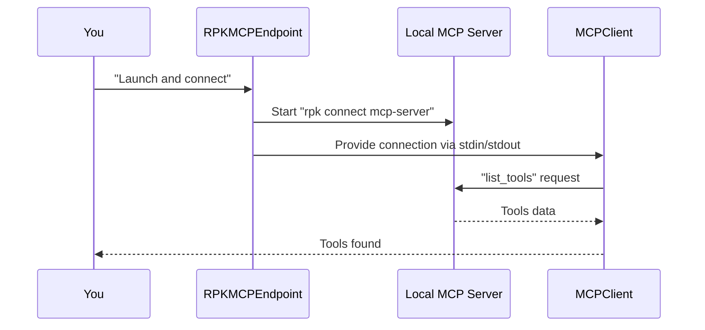

# Chapter 6: RPKMCPEndpoint

In the [previous chapter: MCPEndpoint](05_mcpendpoint_.md), you learned how an Agent can communicate with external servers or local processes using different connection methods. Now, let’s explore a specialized version called “RPKMCPEndpoint.” Think of it as a shortcut to launch a local “rpk connect mcp-server” command in a folder, so you don’t have to host a remote service elsewhere—perfect for local testing or development.

---

## 1. Why RPKMCPEndpoint?

Suppose you have a local folder that contains some specialized tools or data transformations you want to test. Instead of separately starting the server and then connecting the Agent to it, you can let RPKMCPEndpoint do both steps at once:
1. Launch the command "rpk connect mcp-server ."
2. Communicate through stdin/stdout as if it were a remote service.

This means your Agent can “call out” to Tools in that folder, but everything happens locally and on-demand.

---

## 2. A Simple Use Case

Imagine you have some local data tasks that your Agent can’t (or shouldn’t) handle all by itself (like data cleansing or formatting). Instead of coding it into the Agent directly, you set up a local MCP server script that does it. With RPKMCPEndpoint, one line of code spawns that server process in a specified folder, then the Agent can immediately talk to it.

### Minimal Example

Below is a super-short snippet that shows how to:
1. Create an RPKMCPEndpoint for a local directory.  
2. Fire up the “mcp-server” command in that directory.  
3. Use an Agent to query the newly launched server’s Tools.

```python
import asyncio
from pathlib import Path
from redpanda.agents import Agent
from redpanda.agents._mcp import RPKMCPEndpoint, mcp_client

async def local_mcp_demo():
    endpoint = RPKMCPEndpoint(directory=Path("/path/to/my_local_project"))
    async with mcp_client(endpoint) as client:
        await client.initialize()
        available_tools = await client.list_tools()
        print("Local Tools:", [t.name for t in available_tools])

asyncio.run(local_mcp_demo())
```
Explanation:  
• We import `RPKMCPEndpoint` and pass a folder path to it.  
• Under the hood, it runs “rpk connect mcp-server .” in that folder (the dot refers to the folder’s path).  
• We create an `mcp_client(endpoint)` context to talk to that local server.  
• We list the Tools to confirm the server is up and running.

---

## 3. How It Works (Step-by-Step)

Let’s see a simple flow of what happens when you run the code above:



1. You create an RPKMCPEndpoint and request a connection.  
2. RPKMCPEndpoint spawns the local “rpk connect mcp-server” command in your chosen folder.  
3. The endpoint sets up stdin/stdout communication with that process.  
4. The MCPClient uses this channel to send commands like “list_tools” or “call_tool.”  
5. The process replies with the data about the available Tools.  
6. You see the final list of Tools in your Python code.

---

## 4. Under the Hood

RPKMCPEndpoint is simply a subclass of [StdioMCPEndpoint](05_mcpendpoint_.md#simple-use-case) with the command and arguments set to `"rpk connect mcp-server"`. Here’s a simplified look (shortened for clarity) in [src/redpanda/agents/_mcp.py](https://github.com/redpanda-data/agent/blob/main/src/redpanda/agents/_mcp.py):

```python
class RPKMCPEndpoint(StdioMCPEndpoint):
    def __init__(self, directory: Path | str | None, cache_tools: bool = True):
        super().__init__(
            params=StdioServerParameters(
                command="redpanda-connect",
                args=["mcp-server", "."],
                env={...},
                cwd=directory,
            ),
            cache_enabled=cache_tools,
        )
```

• It passes the local folder as `cwd`.  
• It sets up the arguments so that “mcp-server .” is launched inside that folder.  
• Communication is done through standard I/O, just like any other MCPEndpoint.

---

## 5. Putting It All Together with an Agent

Once you have this endpoint, you can attach it to your Agent to seamlessly use any Tools defined in your local server folder. For example:

```python
from redpanda.agents import Agent
from redpanda.agents._mcp import RPKMCPEndpoint

endpoint = RPKMCPEndpoint(directory="my_local_project")
my_agent = Agent(
    name="LocalAgent",
    model="openai/gpt-3.5-turbo",
    mcp_endpoints=[endpoint]  # We can list multiple endpoints if we want
)

# Now my_agent can discover Tools from this local server automatically!
```
Explanation:  
• We pass `[endpoint]` to `mcp_endpoints` so our Agent knows where to find remote (or local-remote) Tools.  
• The Agent will call out to that folder’s Tools if it sees a request that matches them.

---

## 6. Key Takeaways and Next Steps

By using RPKMCPEndpoint:
• You can spin up a local server environment on demand—no separate service needed.  
• It behaves just like any other remote or local server from the Agent’s perspective.  
• Great for testing or when your data pipelines live in the same repo as your Agent.

Next time, we’ll look more closely at [mcp_client](07_mcp_client_.md), which is the library helper that actually does most of the handshake and messaging between your Python code and the server. You’ll see how it all fits together behind the scenes!

Enjoy experimenting with your locally spawned server—happy testing!
