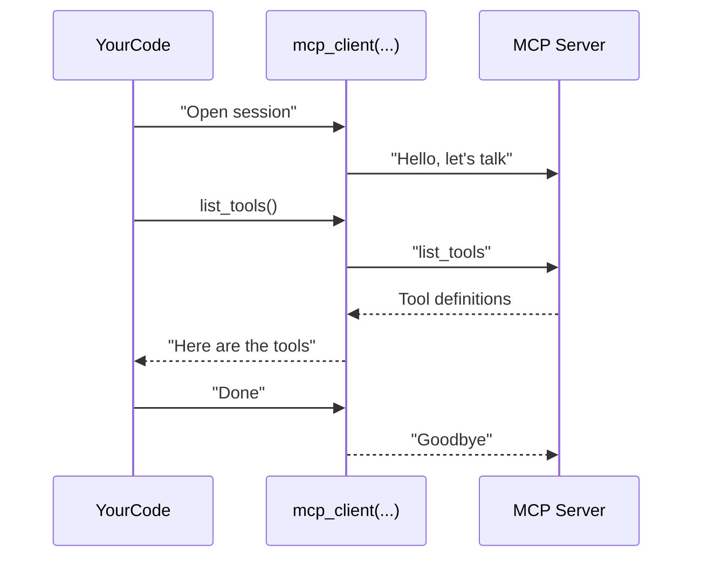

# Chapter 7: mcp_client

In the previous chapter, [RPKMCPEndpoint](06_rpkmcpendpoint_.md), we saw how an Agent can spin up a local MCP process using the “rpk connect mcp-server” command. Now, let's explore the core function that actually sets up the conversation with any MCP server—whether it’s local, remote, using Standard I/O, SSE, or WebSocket:

• The function name: `mcp_client`  
• Purpose: Creates a temporary communication channel to an MCP server.  
• Think of it like starting a quick “conference call,” doing some tasks (like listing available Tools or calling them), and then hanging up.

---

## 1. Why We Need mcp_client

Imagine your Agent wants to explore new Tools hosted in a remote server. You don’t want your Agent to manually open a connection, authenticate, request tool data, parse responses, etc. That’s a lot of repetitive work.

The `mcp_client` function does all of that heavy lifting:
1. It takes an [MCPEndpoint](05_mcpendpoint_.md) (which specifies how and where to connect).  
2. It sets up the communication wires.  
3. Inside a friendly Python `async with` block, you can list or call Tools.  
4. When the block ends, it cleans up everything automatically (like hanging up a call).

---

## 2. A Simple Use Case

Let’s say we have an endpoint to a local process or to a remote server. We just want to:
1. Start the client session.  
2. Fetch the available Tools.  
3. Print the names of those Tools.  

Below is a super short code snippet (fewer than 20 lines) showing how to do it:

```python
import asyncio
from redpanda.agents._mcp import mcp_client
# Suppose 'my_endpoint' is an MCPEndpoint from a previous example.

async def list_remote_tools(my_endpoint):
    async with mcp_client(my_endpoint) as client:
        await client.initialize()      # Start the conversation
        tools = await client.list_tools()
        print("Available Tools:", [t.name for t in tools])

# Usage
# asyncio.run(list_remote_tools(my_endpoint))
```

### How It Works  
1. We enter the `async with mcp_client(my_endpoint)` block, which dials into the MCP process.  
2. We call `client.initialize()` to let the server know we’re ready.  
3. We request the list of Tools and print their names.  
4. After we exit the `async with` block, the line is automatically closed.

---

## 3. Step-by-Step Under the Hood

Below is a quick, simplified sequence diagram showing the main participants in a typical scenario where we list Tools over an MCP connection:



1. Your code calls `mcp_client(...)` with an Endpoint.  
2. `mcp_client` sets up the channel to the server.  
3. You run your desired commands (like `list_tools()`).  
4. Once finished, the session ends politely.

---

## 4. Calling a Single Tool

If you already know the name of a Tool and want to call it, that’s easy too. Here’s a small snippet that’s under 20 lines:

```python
import asyncio
from redpanda.agents._mcp import mcp_client

async def call_math_tool(endpoint):
    async with mcp_client(endpoint) as client:
        await client.initialize()
        result = await client.call_tool("AdderTool", {"numbers": [1, 2, 3]})
        print("Sum result:", result)

# Usage
# asyncio.run(call_math_tool(my_endpoint))
```

Explanation:  
• We open the session and initialize.  
• We call a tool named “AdderTool” with `{"numbers": [1,2,3]}`.  
• The server does the math, and we print the result.

---

## 5. A Peek at the Internal Implementation

Here’s a shortened version of the `mcp_client` function as found in [src/redpanda/agents/_mcp.py](../src/redpanda/agents/_mcp.py). Notice how it handles different Endpoint types (like standard I/O, SSE, or WebSocket) with the same base protocol:

```python
@asynccontextmanager
async def mcp_client(server: MCPEndpoint):
    if isinstance(server, StdioMCPEndpoint):
        async with stdio_client(server.params) as (read, write):
            async with ClientSession(read, write) as session:
                yield MCPClient(server, session)
    elif isinstance(server, SSEMCPEndpoint):
        async with sse_client(server.url) as (read, write):
            async with ClientSession(read, write) as session:
                yield MCPClient(server, session)
    # ... similarly for WebSocket
```

### What’s Happening?
1. Based on the `MCPEndpoint` type, it sets up the correct input/output channels (stdio, SSE, or WebSocket).  
2. It creates a `ClientSession` (lower-level object to handle protocol details).  
3. Finally, it yields an `MCPClient`, which has higher-level functions like `list_tools()` and `call_tool()`.

---

## 6. Summary and Next Steps

Through `mcp_client`, your Agent can conveniently “dial” into any MCP server, gather available Tools, and call them as needed—then hang up. This function’s design keeps everything neat and consistent, no matter which transport method you choose.

• We learned why `mcp_client` is essential—managing the connection, initialization, and teardown with minimal effort.  
• We saw how to list Tools or call them directly.  
• We peeked behind the scenes at how it picks the right communication method.

In the next chapter, [RuntimeServer](08_runtimeserver_.md), we’ll explore a bigger picture: how to host and run these Tools as a server process, so others can connect via `mcp_client` to your own system. Stay tuned!
