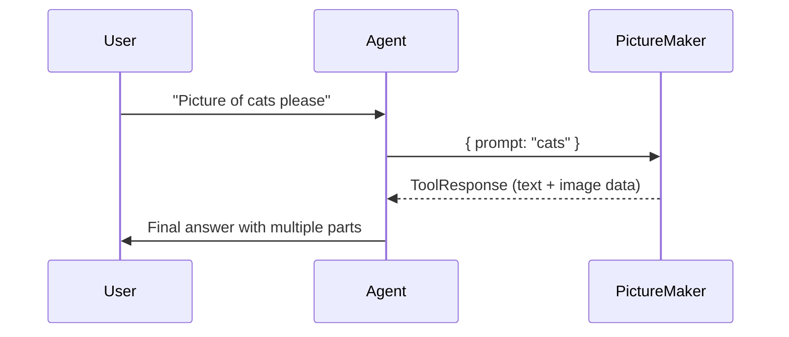

# Chapter 3: ToolResponse

In [Chapter 2: Tool](02_tool_.md), we learned how an Agent can delegate specialized tasks to Tools. But sometimes a Tool needs to return more than simple text—like a text answer plus a base64-encoded image, or multiple pieces of data together. That’s where the concept of a ToolResponse comes in!

---

## 1. Why Do We Need ToolResponse?

Imagine you have an Agent that generates images using a specialized Tool. The Tool might:
• Produce text describing what it did, and  
• Also produce the generated image data in base64 form.

If the Tool just returns a string, it’s hard to embed all these pieces in a clean, structured way. You’d have to mash text and base64 data together. Confusing, right?

ToolResponse acts like a neat “gift basket” for the Tool’s output. It can carry various items—like text content, image content, or more—clearly labeled so the Agent can handle each part gracefully.

---

## 2. Key Idea: A Container for Different Output Types

ToolResponse makes it possible to return multiple “contents” in one response. Here are two common types of content:

1. Text Content  
2. Image Content (base64-encoded)

These outputs are stored in a list, allowing Tools to mix and match. An example might look like this:
- A text piece giving a summary.  
- An image piece with a base64-encoded picture.  

The Agent can then decide how to present all these pieces to the user.  

---

## 3. A Simple Use Case: Image Generation Tool

Let’s say we have a Tool called `PictureMaker` that generates an image based on some text prompt. We want to return both a short text saying “Here’s your image!” and the actual image data. Below is a minimal example.

### 3.1 Defining a Tool That Returns a ToolResponse

```python
# picture_maker_tool.py
from redpanda.agents import Tool, ToolResponse
from redpanda.agents import ToolResponseTextContent, ToolResponseImageContent

class PictureMaker(Tool):
    """
    A simple tool that generates an image and returns both text and the image data.
    """

    def __init__(self):
        super().__init__(
            name="PictureMaker",
            description="Generates an image from a text prompt.",
            parameters={
                "type": "object",
                "properties": {
                    "prompt": {"type": "string"}
                },
                "required": ["prompt"]
            }
        )

    async def __call__(self, args: dict) -> ToolResponse:
        user_prompt = args["prompt"]
        
        # (1) Imagine we do fancy image generation here.
        # Skipping the real code for simplicity.
        generated_image_base64 = "iVBORw..."  # pretend base64 data

        # (2) Construct a ToolResponse with text + image
        return ToolResponse(content=[
            ToolResponseTextContent(data="Here's an image for: " + user_prompt),
            ToolResponseImageContent(data=generated_image_base64, mime_type="image/png")
        ])
```

#### How It Works
1. We subclass `Tool` and define a JSON schema that requires a `"prompt"` parameter.  
2. Inside `__call__`, we generate or fetch the image (faked here).  
3. We then build a `ToolResponse` object with two pieces of content: one text content and one image content.  

---

## 4. Using the ToolResponse in the Agent

Let’s create an Agent using our `PictureMaker` tool. Suppose we send the Agent a prompt like “Generate a small cat image.” The Agent will call `PictureMaker` behind the scenes and receive a ToolResponse.

```python
# main.py
import asyncio
from redpanda.agents import Agent
from picture_maker_tool import PictureMaker

# 1) Create the tool
picture_tool = PictureMaker()

# 2) Create the agent and attach the tool
my_agent = Agent(
    name="ImageAgent",
    model="openai/gpt-3.5-turbo",
    instructions="You can use PictureMaker to generate images from text.",
    tools=[picture_tool]
)

# 3) Run and see what happens
async def run_agent():
    response = await my_agent.run("Please generate me a picture of a small cat.")
    print(response)  # The Agent will eventually include text + image data in some manner

asyncio.run(run_agent())
```

### What Happens Behind the Scenes?

1. The Agent sees the user prompt: “Please generate me a picture of a small cat.”  
2. It decides to call the `PictureMaker` Tool with `{ "prompt": "a small cat" }`.  
3. The `PictureMaker` returns a ToolResponse containing both text (“Here’s an image for: a small cat”) and the base64-encoded image.  
4. The Agent integrates this content into its final output for the user.

---

## 5. Step-by-Step Internal Flow

Below is a simplified sequence diagram showing the flow of a request that returns a ToolResponse.



1. The user requests an image of cats.  
2. The Agent calls the `PictureMaker` tool with the needed prompt.  
3. The tool returns a `ToolResponse` including both text and base64 image content.  
4. The Agent compiles these pieces and sends them back in a user-friendly format.

---

## 6. Under the Hood in the Code

In [src/redpanda/agents/_tools.py](https://github.com/redpanda-data/agent/blob/main/src/redpanda/agents/_tools.py), you’ll see code defining:
- `ToolResponse`, which has a list of content items.  
- `ToolResponseTextContent`, representing text.  
- `ToolResponseImageContent`, representing a base64-encoded image.

Here’s a mini excerpt (simplified):

```python
# (Simplified) from _tools.py

class ToolResponseTextContent(BaseModel):
    type: Literal["text"] = "text"
    data: str

class ToolResponseImageContent(BaseModel):
    type: Literal["image"] = "image"
    data: str
    mime_type: str

class ToolResponse(BaseModel):
    content: list[ToolResponseTextContent | ToolResponseImageContent] = []
```

When a Tool returns a `ToolResponse`, the Agent looks at `content[]` and handles each piece accordingly—combining them into the final user-facing answer.

---

## 7. Putting It All Together

• Tools can now return more complex data than plain text.  
• `ToolResponse` bundling helps keep outputs tidy and easy for the Agent to interpret.  
• This becomes especially useful when you have text plus attachments (like images) or multiple text snippets.

---

## 8. Summary and Next Steps

Congratulations! You’ve just learned how to return structured output from a Tool. This means your Agent can share more nuanced and multimedia-rich responses with the user.

In the next chapter, we’ll see how you can tap into special events and customize the Agent’s behavior further by using [AgentHooks](04_agenthooks_.md). Keep learning, and soon you’ll have an even deeper level of insight and control over the Agent’s decision-making process!
