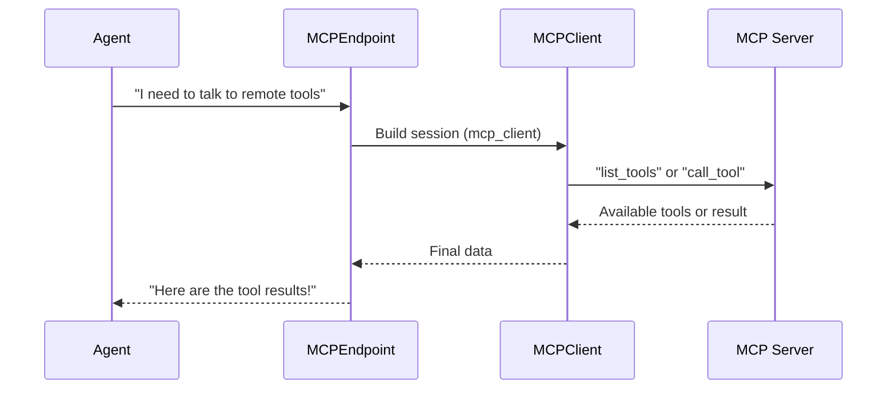

# Chapter 5: MCPEndpoint

In the [previous chapter: AgentHooks](04_agenthooks_.md), we saw how to track key moments in an Agent’s workflow. Now, let’s shift our focus to something more “outward facing”: connecting your Agent to external servers! This is where the class “MCPEndpoint” comes in.

--------------------------------------------------------------------------------

## 1. Why MCPEndpoint?

Sometimes, your Agent might not have all the tools it needs locally. Or maybe you want to delegate tasks to a remote service. MCPEndpoint is like creating a “phone line” for your Agent to talk to any external MCP (Multi-Channel Processing?) server, whether it’s running on your local machine or out on the internet.

For example:
• You can connect via standard input/output (like launching a program and talking with it).  
• You can connect via Server-Sent Events (SSE).  
• You can connect via WebSocket.  

Think of MCPEndpoint as the base blueprint. Different subclasses (e.g., StdioMCPEndpoint, SSEMCPEndpoint, WebsocketMCPEndpoint) each handle one style of communication.

--------------------------------------------------------------------------------

## 2. Simple Use Case: Connecting to a Remote Service

Let’s say you have a remote MCP server at “https://my-remote-service.com/sse.” You want your Agent to call Tools that live on that server. Step one is to create an SSEMCPEndpoint and then load it into an MCP client.

Below is a minimal code snippet that shows how to do this in under 20 lines:

```python
# main.py
import asyncio
from redpanda.agents import SSEMCPEndpoint
from redpanda.agents._mcp import mcp_client

async def connect_to_remote():
    endpoint = SSEMCPEndpoint(url="https://my-remote-service.com/sse")

    # Create a client session
    async with mcp_client(endpoint) as client:
        # Initialize communication
        await client.initialize()

        # Fetch a list of Tools from the remote MCP server
        tools = await client.list_tools()
        print("Tools found:", [t.name for t in tools])

asyncio.run(connect_to_remote())
```

### Explanation

1. We create an SSEMCPEndpoint pointing to our remote SSE URL.  
2. We call “mcp_client(endpoint)” to open a session with that remote server.  
3. We call “client.initialize()” to get everything ready.  
4. We fetch a list of Tools that the server says it can handle.  
5. We print them just to see what’s available.

--------------------------------------------------------------------------------

## 3. MCPEndpoint in Action

Once your endpoint is created, the Agent can seamlessly use the remote Tools. For instance, if your MCP server exposes a math or image-generation tool, the Agent can discover and call it—just like a local Tool. This means your system can “reach out” to specialized services whenever needed.

Below is a simplified sequence of what happens when your Agent calls a remote tool through MCPEndpoint:



1. The Agent has an Endpoint describing how to talk to the server.  
2. That Endpoint creates a Client session to manage the actual read/write communication.  
3. The Client calls the server’s API (like “list_tools” or “call_tool”).  
4. The server replies with tool definitions or tool outputs.  
5. The Endpoint returns the result back to the Agent.

--------------------------------------------------------------------------------

## 4. Under the Hood

Behind the scenes, MCPEndpoint is just an agreement for how to connect. Let’s see a tiny peek inside the file [src/redpanda/agents/_mcp.py](https://github.com/redpanda-data/agent/blob/main/src/redpanda/agents/_mcp.py). Don’t worry if it looks advanced—this is just to show how it fits together.

```python
class MCPEndpoint:
    def __init__(self, cache_enabled: bool):
        self._cache_enabled = cache_enabled
        self._cached_tool_list = None

class SSEMCPEndpoint(MCPEndpoint):
    def __init__(self, url: str, cache_enabled: bool = True):
        super().__init__(cache_enabled)
        self.url = url
```

• MCPEndpoint stores basic settings (like whether to cache the list of tools).  
• SSEMCPEndpoint extends it, adding a “url” for connecting via SSE.

Later, there’s a helper function, “mcp_client(...),” that uses the right client logic (SSE, stdin/stdout, WebSocket, etc.) based on which MCPEndpoint you gave it.

--------------------------------------------------------------------------------

## 5. Example: Calling a Remote Tool

Once you’ve created and initialized your MCPClient, you can call any Tool the server provides. Below is a small example showing how to call a single remote Tool by name:

```python
# call_remote_tool.py
import asyncio
from redpanda.agents import SSEMCPEndpoint
from redpanda.agents._mcp import mcp_client

async def invoke_math_tool():
    endpoint = SSEMCPEndpoint(url="https://my-remote-service.com/sse")
    async with mcp_client(endpoint) as client:
        await client.initialize()

        # Suppose there's a "RemoteMath" tool on the server
        result = await client.call_tool("RemoteMath", {"operation": "add", "numbers": [2, 5]})
        print("Result from remote math tool:", result)

asyncio.run(invoke_math_tool())
```

Explanation:  
• We connect to the same SSE endpoint.  
• We call “invoke_math_tool” with the necessary parameters.  
• The server does the math and returns the result (maybe a [ToolResponse](03_toolresponse_.md) object) back to us.

--------------------------------------------------------------------------------

## 6. When to Use MCPEndpoint vs Local Tools

• Use MCPEndpoint if you want to leverage Tools that don’t live inside your Python code—like an external microservice or a specialized engine.  
• If your tasks are self-contained (like a small math function), you can keep the Tool local.  
• The beauty of MCPEndpoint is that your Agent can automatically discover and interact with new Tools as they’re added to the remote server—no need to update your local code!

--------------------------------------------------------------------------------

## 7. Summary & Next Steps

• MCPEndpoint is your “bridge” to external servers hosting Tools.  
• Different subclasses handle different connection methods: Stdio, SSE, WebSocket, etc.  
• You gain the flexibility of calling local or remote Tools in a uniform way.

Next time, we’ll look more closely at [mcp_client](07_mcp_client_.md), which is the library helper that actually does most of the handshake and messaging between your Python code and the server. You’ll see how it all fits together behind the scenes!
