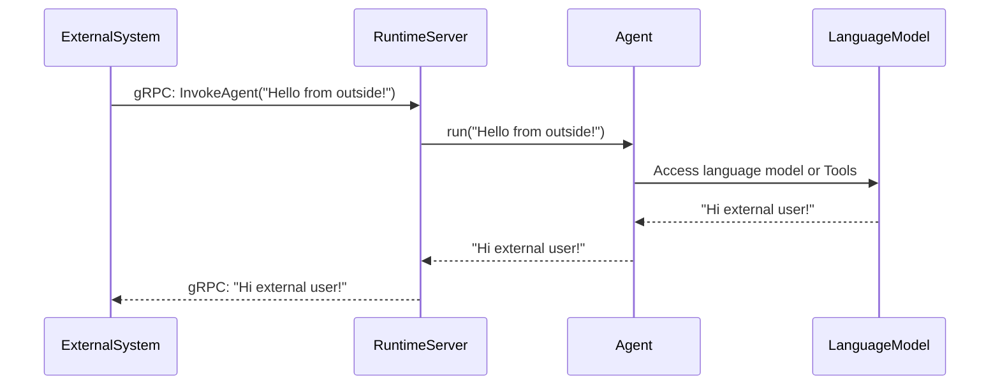

# Chapter 7: RuntimeServer

In [Chapter 6: mcp_client](07_mcp_client_.md), we learned how to tap into an existing server that hosts tools or services. But what if you want others to tap into your Agent in the same way—via a simple, well-defined interface? That’s exactly where “RuntimeServer” shines.

Imagine you have an Agent with all sorts of logic or tooling behind it, and you want to let an external system send requests. The external system might not speak Python, or it might be on a totally different tech stack. By using RuntimeServer, you can expose your Agent as a gRPC service—letting outside callers invoke it in real time, just like a translator who relays messages back and forth.

--------------------------------------------------------------------------------

## 1. Why RuntimeServer?

The primary goal: make your Agent accessible to external systems via gRPC calls. Here’s the high-level idea:
• External callers send structured requests (e.g., Protobuf or JSON data).  
• RuntimeServer receives those gRPC calls and translates them into a format the Agent understands.  
• The Agent processes the request (possibly calling Tools) and returns a response.  
• RuntimeServer then wraps the response back into gRPC format for the caller.

This flow means you can integrate your Python Agent into larger applications and microservices—enabling real-time processing without forcing everyone else to speak Python.

--------------------------------------------------------------------------------

## 2. A Very Simple Example

Below is a minimal snippet demonstrating how to start a RuntimeServer around an Agent. This lets external gRPC clients call “InvokeAgent” operations:

```python
import asyncio
from redpanda.agents import Agent
from redpanda.runtime._grpc import RuntimeServer, serve_main

async def main():
    # 1) Create an Agent with minimal setup
    my_agent = Agent(
        name="MyRuntimeAgent",
        model="openai/gpt-3.5-turbo",
        instructions="You are now accessible via gRPC. Respond clearly."
    )

    # 2) Create a RuntimeServer with that Agent
    server = RuntimeServer(my_agent)

    # 3) Start the server (it will pick a port automatically and print it)
    await serve_main(server)

asyncio.run(main())
```

Explanation:  
1. We import our Agent and the server utilities.  
2. We create an Agent exactly as in previous chapters (optionally including Tools, instructions, etc.).  
3. We wrap that Agent in `RuntimeServer` and call `serve_main(...)`.  
4. Once this is running, external gRPC clients can connect, send a message, and get a response from the Agent.

--------------------------------------------------------------------------------

## 3. Step-by-Step Flow Under the Hood

When an external system calls your new gRPC service, the interaction looks like this:



1. The external system sends data via gRPC.  
2. RuntimeServer translates that data into plain text or JSON for the Agent.  
3. The Agent uses its logic or even calls Tools (if needed).  
4. The Agent returns the final response to RuntimeServer.  
5. RuntimeServer wraps it back into a gRPC message and sends it to the external caller.

--------------------------------------------------------------------------------

## 4. Handling Structured Data

In many cases, external clients prefer sending structured data (like JSON or base64-encoded images). RuntimeServer automatically handles these conversions:
• If the caller sends a structured Protobuf payload, RuntimeServer can turn that into JSON or text for the Agent.  
• If the Agent returns complex data, RuntimeServer can package it back into Protobuf (e.g., base64 for binary content).  

This all happens behind the scenes, so your Agent can focus on logic instead of worrying about how to parse or serialize messages.

--------------------------------------------------------------------------------

## 5. Where the RuntimeServer Code Lives

The core code for RuntimeServer can be found in [src/redpanda/runtime/_grpc.py](https://github.com/redpanda-data/agent/blob/main/src/redpanda/runtime/_grpc.py). If you open it, you’ll see something like this (shortened and simplified):

```python
# (Simplified) runtime/_grpc.py

class RuntimeServer(grpcpb.RuntimeServicer):
    def __init__(self, agent: Agent):
        self.agent = agent

    async def InvokeAgent(self, request, context):
        try:
            # Convert incoming message to what the Agent understands
            payload = request.message.serialized.decode("utf-8")
            output = await self.agent.run(payload)

            # Wrap the Agent's response in gRPC form
            return pb.InvokeAgentResponse(
                message=pb.Message(
                    serialized=output.encode("utf-8")
                ),
            )
        except Exception as e:
            context.set_code(grpc.StatusCode.INTERNAL)
            context.set_details(str(e))
            raise
```

Explanation of the snippet:  
1. `RuntimeServer` inherits from `RuntimeServicer`, a gRPC class stub generated from .proto definitions.  
2. In `InvokeAgent`, it reads the request payload and decodes it to text (or structured JSON if needed).  
3. It then calls `agent.run(...)` passing that text.  
4. Whatever text or JSON the Agent returns is wrapped back into a gRPC `InvokeAgentResponse` message.

The `serve_main(server)` function further sets up a gRPC server object, binds to a port, and listens for requests.

--------------------------------------------------------------------------------

## 6. Ready to Let Others In

With the RuntimeServer approach, any application that can make gRPC calls can now ask your Agent questions. For example:
• A Node.js or Java service can say, “Hey, Agent, how do I parse this data?”  
• A web front-end can call your service through a gateway.  
• Another microservice performing data transformation can query your Agent for more advanced reasoning.

In all of these scenarios, your Python Agent is no longer locked inside local script-land. It’s out in the open, ready to serve real-time requests.

--------------------------------------------------------------------------------

## 7. Conclusion

• RuntimeServer is the final piece that lets you expose your Agent to the outside world through gRPC.  
• It automatically manages data translation to and from Protobuf, so your Agent can focus on actual reasoning.  
• By combining [Agent](01_agent_.md), [Tools](02_tool_.md), [AgentHooks](04_agenthooks_.md), and now RuntimeServer, you have a complete pipeline for building intelligent, extensible applications.

This concludes our entire journey! You now have the know-how to build Agents, create Tools, gather responses, hook into key events, connect to external resources, and serve your Agent via gRPC. Happy building, and thank you for following along!
